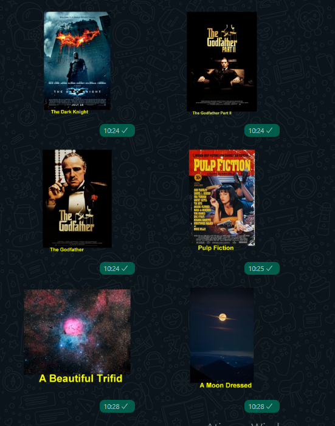

## IMDB-Stickers

  

    
    <a href="">
        </img>
    </a>
    
    

    <a href="#projeto-">Projeto</a> &nbsp;&nbsp;&nbsp;|&nbsp;&nbsp;&nbsp;
    <a href="#tecnologias-">Tecnologias</a> &nbsp;&nbsp;&nbsp;|&nbsp;&nbsp;&nbsp;
    <a href="#layout-">Layout</a> &nbsp;&nbsp;&nbsp;|&nbsp;&nbsp;&nbsp;
    <a href="#licença-%EF%B8%8F">Licença</a>

### Layout 🚧

<h4 align='center'><h4 align='center'></h4></h4>

## Projeto 💻

Imersão Java da ALURA:

Utilizar a API do IMDB dos 250 melhores filmes para criar Stickers

## Tecnologias 🛠

- <a href="https://docs.oracle.com/javase/8/docs/api/">  JAVA | documentation </a>

#### documentation 📜

_`Aula 1 :`_

- [IMDB | API](https://imdb-api.com/api)
- [Class HttpRequest](https://docs.oracle.com/en/java/javase/17/docs/api/java.net.http/java/net/http/HttpRequest.html)

_`Aula 2 :`_

- [javax.imageio](https://docs.oracle.com/en/java/javase/17/docs/api/java.desktop/javax/imageio/package-summary.html)
- [Class BufferedImage](https://docs.oracle.com/en/java/javase/17/docs/api/java.desktop/java/awt/image/BufferedImage.html)
- [Class Graphics2D](https://docs.oracle.com/en/java/javase/17/docs/api/java.desktop/java/awt/Graphics2D.html)
- [Class InputStream](https://docs.oracle.com/en/java/javase/17/docs/api/java.base/java/io/InputStream.html)

_`Aula 3 :`_

- [NASA | API](https://api.nasa.gov/)
- [getters e setters](https://www.alura.com.br/artigos/nao-aprender-oo-getters-e-setters)

<!-- _`Aula 4 :`_
- [Spring](https://start.spring.io/) -->

## Licença ⚖️

This project is under the MIT license. See the archive [LICENSE](https://github.com/GabrielMedradoS/IMDB-Stickers/blob/master/License) for more details.

## Autor ✍🏾

| <a href="https://github.com/gabrielmedrados/"> 
| :-------------------------: |
| <a href="https://github.com/gabrielmedrados/"> Gabriel Medrado |</a> |

## Instrutores e Instrutoras da Alura nessa imersão

|                                      |                     |                        |
| :----------------------------------------------------------------------------------------------------------------------------------------------------------------------------: | :---------------------------------------------------------------------------------------------------------------------------------------------------------------: | :--------------------------------------------------------------------------------------------------------------------------------------------------------------: |
|  |  |  |
